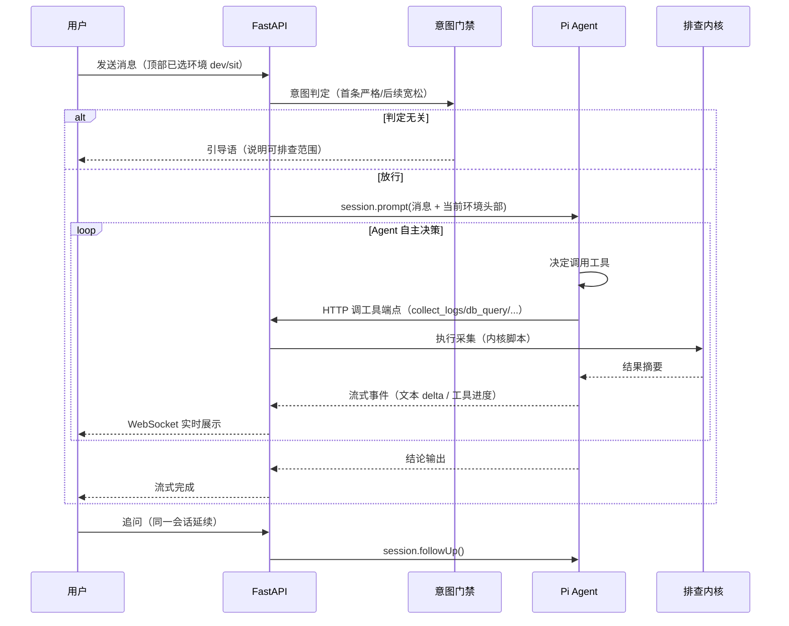

# 问题排查平台技术方案

> 项目路径：`/Users/zhaoxin/code/ai/ai_study/issue-investigation`
> 日期：2026-08-04

## 1. 背景与目标

### 1.1 需求背景

研发账务组日常需要排查 dev/sit 环境的问题（日志报错、落库异常、配置疑似有误、数据核对），目前依赖 Cursor/Claude 等 Agent + `issue-investigation` skill 的 CLI 驱动方式：

- 用户在本机启动 driver，填表单（HTML/Canvas），Agent 按状态机逐步采集 ES 日志、查库、扫代码，最后产出结构化报告（§1–§5）
- 整个过程绑死在个人机器 + 特定 Agent 宿主上，团队其他人无法直接使用；每次排查的产物散落在各业务仓 `.issue-inv/` 下，不可追溯

### 1.2 目标

建设一个 **Web 平台化的问题排查工具**：

- 用户打开网页，以**对话方式**描述问题（traceId / 告警 / 数据核对诉求），Agent 自动执行采集与分析并流式展示
- 支持**多轮追问**（"再查下这张表""换 sit 环境再看"），对话上下文延续
- 排查过程与产物（对话记录、报告、证据）**完整留存**，可回看
- 部署在团队内网，成员通过浏览器直接使用（本机先行，k8s 后置）

### 1.3 边界（本次不做）

- 不接入生产环境（prod 独立方案，平台仅支持 dev/sit）
- 不做登录认证（内网开放）
- 历史仅作**只读归档**：提供列表与详情查看，**不做模糊查询/检索/字段过滤**（无数据库）
- 不做 Web 表单 / Cursor Canvas（原有表单交互被聊天界面取代）
- 不做批量/定时任务，单会话串行排查
- **单会话沟通上限 10 轮**（用户消息计数），达到后停止受理，引导用户新建会话

## 2. 总体架构

### 2.1 架构图

```mermaid
flowchart LR
    U[用户浏览器<br/>Vue3 + Element Plus] -->|WebSocket 流式| B[FastAPI 后端 :8000]
    B -->|HTTP| P[Pi 分析服务<br/>Bun + pi-coding-agent SDK :8100]
    B -->|进程内 import| K[排查内核<br/>Python 脚本]
    P -->|会话/对话| PS[pi session JSONL]
    B -->|产物| RS[(data/runs/{run_id})]
    K -->|ES 日志| ES[Elasticsearch<br/>dev/sit]
    K -->|只读 SQL| DB[(MySQL dev/sit)]
    K -->|配置查询| N[Nacos dev/sit]
    K -->|代码扫描| G[本机 4 业务仓<br/>goa/lcs/ams/lps]
```

### 2.2 组件职责

| 组件 | 技术 | 职责 |
|---|---|---|
| 前端 | Vue3 + Element Plus + Vite | 聊天界面（流式文本 + 工具进度卡）、历史列表、记录详情、dev/sit 切换 |
| 后端 | Python FastAPI | API 与 WebSocket 桥接、会话/产物管理、意图门禁、工具执行端点（调用排查内核） |
| 排查内核 | Python（复用现有 skill 脚本） | ES 日志采集、源码扫描、Nacos 查询、只读 SQL、报告 §1–§4 生成 |
| Pi 分析服务 | Bun + `@earendil-works/pi-coding-agent` | Agent 循环（多轮对话、工具调用、流式事件）、LLM 推理 |
| LLM 通道 | `opencode-go` provider | OpenAI 兼容接口 `https://opencode.ai/zen/go/v1`，模型 `deepseek-v4-flash`（默认），复用本机 `~/.pi/agent` 配置 |

### 2.3 关键设计决策

| 决策 | 选择 | 理由 |
|---|---|---|
| 后端语言 | Python（FastAPI） | 排查内核 40k+ 行 Python 资产必须进程内复用；任务画像为 I/O 密集文本处理，Python 生态最合适 |
| Agent 内核 | Pi（`pi-coding-agent` SDK） | 多轮对话/工具调用/流式/会话持久化开箱即用；本机已有 opencode-go 通道配置，零新增 LLM 配置 |
| 进程拓扑 | FastAPI 主进程 + Pi sidecar 独立进程 | pi SDK 为 TypeScript，无法 import 进 Python；职责划分：Pi 管"脑"（对话/推理），FastAPI 管"手"（采集执行）+ 平台能力 |
| 存储 | 纯文件，无数据库 | 历史仅归档不查询；`runs/{run_id}/` 目录即全部数据，k8s 阶段 PVC 直接承接 |
| 前端框架 | Vue3 + Element Plus | 内网工具主流选择，组件全；视觉按 frontend-design 标准打磨 |

## 3. 交互设计

### 3.1 对话流程



### 3.2 环境切换（dev/sit）

- 聊天页顶部栏放置 **dev / sit 分段切换控件**，用户可随时切换
- 切换即生效：每轮消息转发前，在消息头部注入 `[当前排查环境: sit]`（所有日志/库表/配置查询均按 sit 执行）
- 环境字段落 `run.json`，历史详情页可回看
- 硬规则（禁止 prod）同时写死在 system prompt 基线与内核 `assert_env_supported` 双保险

### 3.3 意图门禁

目的：平台只做问题排查，拦截无关提问（省 token、引导用户）。

| 位置 | 策略 |
|---|---|
| 会话首条消息 | 严格门禁：必须明确排查意图（日志报错/落库异常/配置问题/数据核对），否则回复引导语，不触发 Agent |
| 后续消息 | 宽松门禁：带最近几轮上下文判定，**默认放行**，仅拦截明显无关闲聊（天气/编程题等）；拿不准一律放行 |

- 判定实现：FastAPI 内一次轻量 LLM 调用（`openai` SDK + opencode-go 通道，deepseek-v4-flash），输出 `{allow, reason}`
- 拦截时回复固定引导语，不消耗 agent 循环；被拦截的对话同样写入 session.jsonl（历史完整）
- 兜底：agent 工具集只有排查类工具（无通用 bash/文件写），system prompt 要求无关问题引导回排查任务；误放行无害，误拦截成本高，故"放行是默认，拦截是例外"

### 3.4 会话轮次上限（10 轮）

每个会话（run）的用户消息**最多 10 轮**，防止单会话无限膨胀（token 成本与上下文失控）。

- **计数口径**：以用户成功发送并放行的消息计（含被门禁拦截的也算一次？——**不计**，拦截消息不消耗轮次；放行后进入 agent 的消息每发送一条计 1）
- **计数存储**：`run.json` 的 `message_count` 字段，发送消息前检查
- **达到上限**：后端拒绝受理（`POST /runs/{id}/messages` 返回 `turn_limit_reached`），提示用户"本轮排查已达 10 轮沟通上限，请新建会话继续"，不触发门禁与 agent；前端输入区禁用并展示提示
- **UI 提示**：会话内实时展示剩余轮次（如"剩余 3/10 轮"），达到上限后按钮置灰
- **拦截消息不计轮次** 的权衡：避免用户被无关引导语消耗配额；恶意刷屏不受保护，但内网工具可接受

## 4. Agent 设计（Pi 分析服务）

### 4.1 会话模型

- 每段排查对话 = 一个 `AgentSession`（`createAgentSession`）
- 会话 JSONL 持久化到平台 `data/pi-sessions/`（显式指定 `agentDir`，不写个人 `~/.pi/agent/sessions/`）
- 多轮追问：`session.followUp()` 延续上下文；页面刷新时从 JSONL 解析消息恢复界面
- 事件流：`session.subscribe()` 监听 `message_update`（text_delta / thinking_delta）、`tool_execution_start/update/end`、`message_end`、`turn_end`，经 WebSocket 转发浏览器

### 4.2 System Prompt

- 角色：问题排查专家（dev/sit 专用）
- 硬规则：仅支持 dev/sit，禁止 prod；以每轮消息头部声明的环境为准
- 行为约束：只回答与当前排查任务相关的内容；无关问题引导回排查任务
- 排查纪律（继承原 skill 规则）：入口语言不推断责任归属；DB 查询先问"缺什么库真相"；证据链驱动归因；代码分支按环境对齐

### 4.3 工具集

| 工具 | 参数 | 说明 | 执行 |
|---|---|---|---|
| `collect_logs` | env, app, traceId/告警, scope | ES 日志采集（focused 双查/broad 广扫、自适应时间窗） | 后端内核 collect_logs.py |
| `scan_code` | env, app, keywords | Java + Mapper XML + Spring 配置 + git 变更关联扫描 | 后端内核 scan_code_context.py |
| `nacos_query` | env, app, key | Nacos 指定 key 查询（group/dataId 自动发现） | 后端内核 collect_nacos.py |
| `db_query` | env, plan | 只读 SQL（≤5 条、自动 LIMIT 20），计划由 Agent 生成 | 后端内核 collect_db.py + agent_db_plan 校验 |
| `run_investigation` | env, app, mode, traceId/告警/biz | 一键执行原 inv_runner 全流水线（logs→db_plan→db→报告 §1–§4），适合完整排查 | 后端内核 inv_runner 流水线 |

工具注册：Pi SDK `defineTool()`，execute 内 HTTP 回调 FastAPI 工具端点。

## 5. 排查内核（复用改造）

### 5.1 来源

从 `zhangwuSkills/.cursor/skills/issue-investigation/scripts/` 拷贝并打包为 `backend/kernel/` Python 包。

### 5.2 带入清单

| 带 | 不带 |
|---|---|
| collect_logs.py / collect_db.py / collect_nacos.py / scan_code_context.py / refetch_logs.py | serve_file_form.py / watch_canvas_submit.py（表单 UI） |
| inv_runner.py（报告 §1–§4 渲染：指纹去重、时序聚类、交叉验证、充分性评分） | issue_inv_cli.py（driver 状态机，被流水线/Agent 替代） |
| lib/：common / correlate / receipt / agent_db_plan / env_config / git_branch / workspace / discover_nacos / hypotheses / evidence_slim / log_collect / infer_db_sql 等 | lib/canvas_bridge.py / lib/file_form.py / lib/plan_mode.py 表单部分 |
| references/：env-connections.json / app-catalog.json / workspace-layout.json / templates/investigation-report.md | form.html / canvas.tsx / permissions / sandbox 示例 |

### 5.3 改造点

| 改造 | 内容 |
|---|---|
| 产物目录参数化 | `<repo>/.issue-inv/` → `data/runs/{run_id}/`，去除对业务仓目录的写入 |
| 去掉表单依赖 | 移除 driver-start / form.html / canvas 相关调用链，采集入口改为工具端点直调 |
| 去除清理逻辑 | 不调用 `prune_stale_temp_runs`，所有中间文件（原始日志、evidence、计划、报告）**一律保留** |
| repo 根固定 | 代码扫描目标固定为本机 4 仓（`/Users/zhaoxin/code/inner/{goa,lcs,ams,lps}`），git 分支对齐逻辑保留 |
| 包化 | 补 `__init__.py`，脚本内部 `lib.xxx` 相对导入改造为包内导入 |

### 5.4 回归验证

改造后先用内核 CLI 直调方式在 dev 环境跑一个历史 case，确认报告 §1–§4 与改造前输出一致。

## 6. 存储设计（纯文件）

```
data/
├── pi-sessions/                 # pi AgentSession JSONL（对话完整记录，含 thinking/工具调用）
└── runs/{run_id}/               # run_id = 时间戳+短uuid，每轮排查一目录
    ├── run.json                 # 元数据+状态机（env/app/mode/traceId/biz/status/message_count/时间线/环境切换记录）
    ├── session.jsonl            # 本 run 的 pi 会话记录（与 pi-sessions 关联）
    ├── investigation-report.md  # 报告 §1–§5
    ├── evidence.json            # 证据
    ├── receipt.json             # 回执
    ├── agent_db_plan.json       # DB 计划（如有）
    └── artifacts/               # 原始采集产物（日志原始结果、DB 行预览等，不清理）
```

- 历史能力：`GET /runs` 列表（时间倒序）+ 详情页只读展示；**无模糊查询/检索/过滤**
- 并发：每 run 独立目录，多会话互不干扰；无共享状态，无需数据库
- k8s 阶段：`data/` 挂 PVC，零迁移成本

## 7. API 设计

| 方法 | 路径 | 说明 |
|---|---|---|
| POST | /runs | 创建排查会话（env, app, mode, traceId/告警/biz, scope） |
| GET | /runs | 历史列表（时间倒序，纯展示） |
| GET | /runs/{id} | 元数据 + 状态 |
| GET | /runs/{id}/messages | 从 session.jsonl 解析对话（页面刷新恢复） |
| GET | /runs/{id}/report | 报告产物（markdown） |
| GET | /runs/{id}/evidence | 证据 |
| WS | /runs/{id}/stream | 实时事件流（文本 delta / 工具进度 / 完成 / 错误） |
| POST | /runs/{id}/messages | 发送用户消息（轮次检查 → 门禁 → 注入环境 → 转发 pi；超 10 轮返回 `turn_limit_reached`） |
| POST | /tools/{tool_name} | 工具执行端点（pi sidecar 回调；含权限校验 token） |
| GET | /envs | 可用环境列表（dev/sit） |

## 8. 前端设计

### 8.1 页面

| 页面 | 内容 |
|---|---|
| 排查会话页（主页） | 顶部：dev/sit 切换 + 会话标题 + 剩余轮次（如"剩余 3/10 轮"）；中部：聊天流（用户消息 / Agent 流式文本 / 工具执行卡片含状态与耗时）；输入区（达上限禁用）；侧栏：报告 §1–§5、证据、DB 结果 |
| 历史列表页 | 时间倒序列出历史 run（标题/环境/时间/状态），点击进入详情 |
| 记录详情页 | 只读回放：完整对话 + 报告 + 证据 + 当时环境标注 |

### 8.2 视觉要求

- 按 frontend-design 标准打磨，深色主题为主，避免工具软件常见的简陋感
- 流式文本 markdown 渲染；工具执行卡片有明确状态（进行中/成功/失败）与耗时
- 环境切换控件醒目，当前环境在对话中可视化标注

## 9. 实施计划

| 阶段 | 内容 | 验收 |
|---|---|---|
| P1 内核打包化 | scripts → backend/kernel 包化、产物目录参数化、去表单/去清理 | CLI 回归 §1–§4 一致 |
| P2 FastAPI 后端 | runs API + WebSocket 桥 + 工具端点 + 意图门禁 + 环境注入 + 轮次限制 | curl 打通创建/列表/详情；10 轮后拒绝新消息 |
| P3 Pi sidecar | AgentSession + 5 工具注册 + system prompt + 事件流转发 | 对话可流式、可追问 |
| P4 前端 | 聊天页 + 历史列表 + 详情页，视觉打磨 | 三页面可完整交互 |
| P5 联调验收 | 真实 case（dev/sit 各一）全链路：提问→排查→追问→环境切换；验证 10 轮上限生效 | 结论对比人工排查一致 |

### 本地运行

```
backend:  uvicorn app.main:app --port 8000        # data/ 为运行目录
analysis: bun run src/index.ts --port 8100        # 复用 ~/.pi/agent 配置
frontend: npm run dev --port 5173                 # proxy /api → 8000
```

## 10. 风险与权衡

| 风险 | 应对 |
|---|---|
| pi 版本迭代快、API 变动 | package.json 锁版本；只依赖稳定 API（createAgentSession/defineTool/subscribe） |
| LLM 通道依赖 opencode.ai 外网 | 本机可达；迁内网服务器时确认可达性或换公司网关（pi 自定义 provider 一处配置） |
| 代码扫描依赖本机 4 仓 | 本机阶段天然满足；k8s 阶段改为服务器镜像仓 + 定时 fetch |
| 门禁误判 | "放行默认、拦截例外"策略 + 工具集约束兜底 |
| 无登录内网开放 | 内网 + ingress 网段限制（k8s 阶段） |
| 临时文件不清理的磁盘增长 | 单文件均小（KB 级）；k8s 阶段配 PVC 容量规划即可 |
